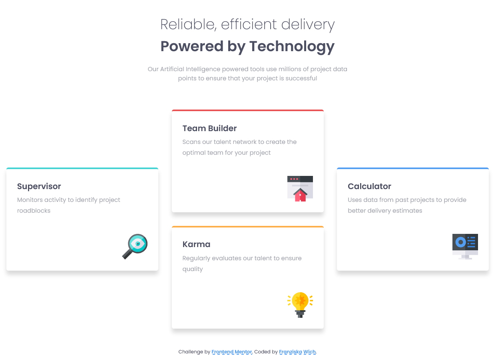
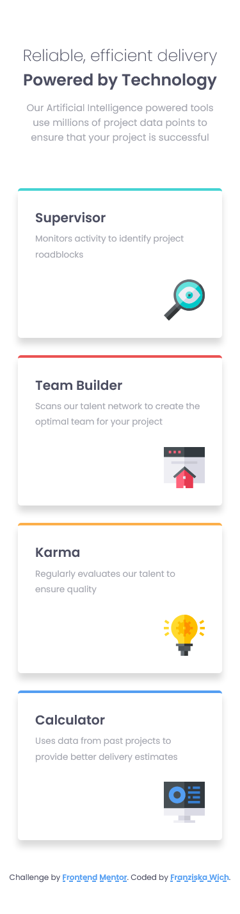

# Frontend Mentor - Four card feature section solution

This is a solution to the [Four card feature section challenge on Frontend Mentor](https://www.frontendmentor.io/challenges/four-card-feature-section-weK1eFYK). Frontend Mentor challenges help you improve your coding skills by building realistic projects.

## Table of contents

- [Overview](#overview)
  - [The challenge](#the-challenge)
  - [Screenshot](#screenshot)
  - [Links](#links)
- [My process](#my-process)
  - [Built with](#built-with)
  - [What I learned](#what-i-learned)
  - [Continued development](#continued-development)
  - [Useful resources](#useful-resources)
- [Author](#author)

## Overview

### The challenge

Users should be able to:

- View the optimal layout for the site depending on their device's screen size

### Screenshot

### Links

- Solution URL: [https://github.com/franziskawich/four-card-feature-section](https://github.com/franziskawich/four-card-feature-section)
- Live Site URL: [Add live site URL here](https://your-live-site-url.com)

## My process

### Built with

- Semantic HTML5 markup
- SCSS (saved as CSS)
- Flexbox
- CSS Grid
- Mobile-first workflow
- BEM

### What I learned

I tried to use the property `column-count` for medium sized devices but that caused problems with the box-shadow, which then got slightly cut off. So I used flexbox instead. I used Grid for larger devices and I was a bit surprised that creating grid areas was all that was needed to achieve the layout goal.

I learned that you can change the `text-decoration-style` to curvy. I thought that was funny, although I did not use it. It looks like a teacher corrected a student`s exam. 😅

Oddly enough, I had a bit of trouble with the small coloured borders at the top of the four cards. At first I thought I could use a `box-shadow`, but then a simple `border-top` was the solution.

All in all, I was pleased that I didn't run into many problems with this challenge. I hope it means that doing these challenges and other courses is starting to pay off and I can finally improving my skills noticlebly.

### Continued development

I have used a little animation for people who did not change their setting for reduced motion when someone hovers over the cards and I am not so happy with the scaling. At least on my monitors the scaling of the text does not look smooth. I am not sure why though. 🤨

### Useful resources

- [Layoutit! (v2)](https://grid.layoutit.com/) - This helped me visualizing my grid for the dektop version.

## Author

- Frontend Mentor - [@franziskawich](https://www.frontendmentor.io/profile/franziskawich)
- freeCodeCamp - [Franziska Wich](https://www.freecodecamp.org/fcc35fab9df-6b8c-445e-8aec-36ee00e99ba0)
